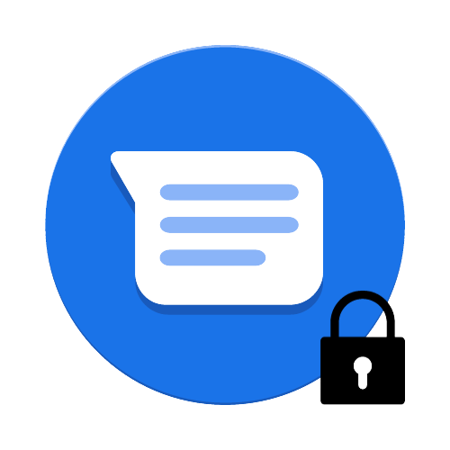

# LockChat

  

(ENG) : Allows you to lock and unlock the public chat in the game.
  

(FRA) : Permet de lock et d'unlock le chat public en jeu.
  

# Configuration :

(ENG) : In the `plugin_data/LockChat/config.yml` folder, specify messages.

(FRA) : Dans le dossier `plugin_data/Mine/config.yml` , indiquez les messages.  

# My discord :

You can join <a href="https://discord.gg/NkZu7DNKEn">here</a> !

